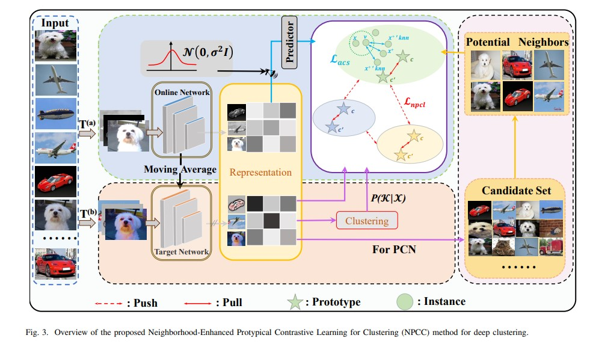
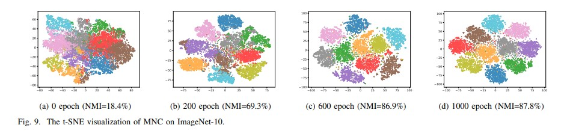

# Mutual Neighborhood-Enhanced Protypical Contrastive Learning for Clustering(MNC)

This is the offical implementation of the paper entitled “Mutual Neighborhood-Enhanced Protypical Contrastive Learning for Clustering” . 

# Proposed Framework

<div align=center></div>

# Main Results

<div align=center></div>

# Dependency

- pytorch>=2.0.1
- torchvision>=0.15.2
- munkres>=1.1.4
- scikit-learn>=1.2.2
- clip>=1.0
- timm>=0.9.2
- faiss-gpu>=1.7.4

# Usage

##Training Commands

The config files are in `config/`, just run the following command:
```shell
export CUDA_VISIBLE_DEVICES=0,1,2,3 # use the first 4 GPUs
torchrun --master_port 17673 --nproc_per_node=4 main.py config/cifar10_r18_propos.yml
```
or
```shell
export CUDA_VISIBLE_DEVICES=0,1,2,3 # use the first 4 GPUs
python -m torch.distributed.launch --nproc_per_node=4 --master_port=17672 main.py config/cifar10_r18_propos.yml
```
## Visualization
<div align=center></div>

# If you find this is helpful for you, please star this hard working.
